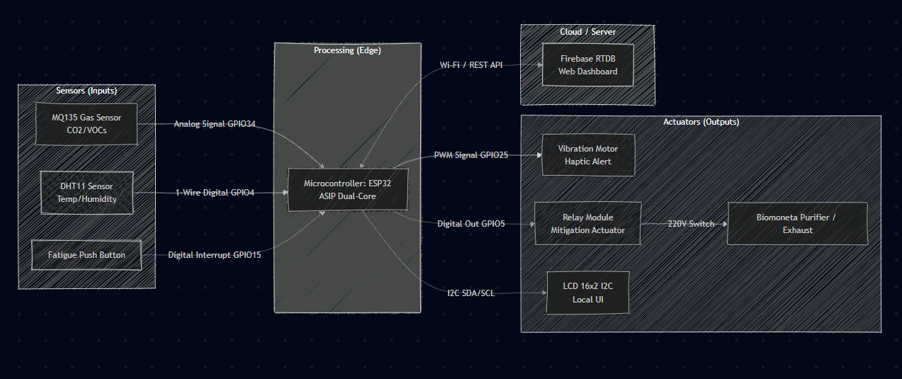
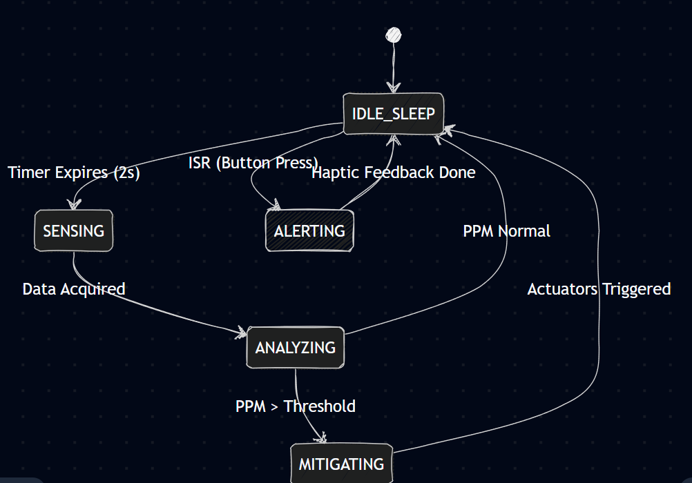
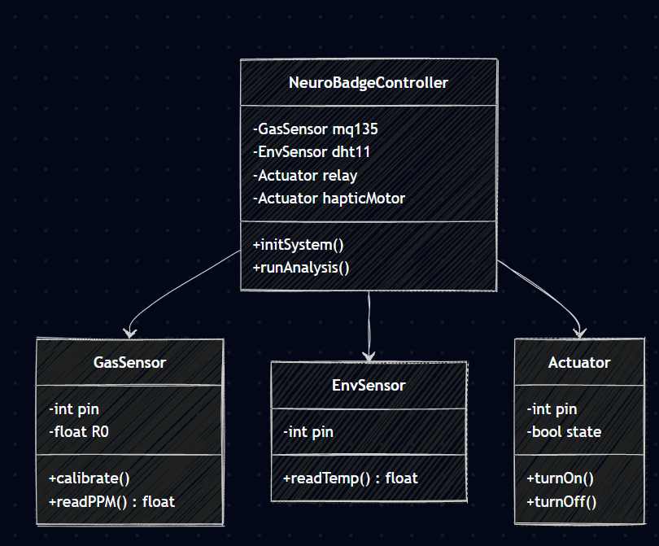
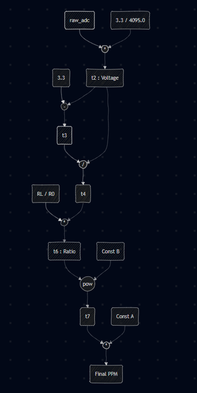
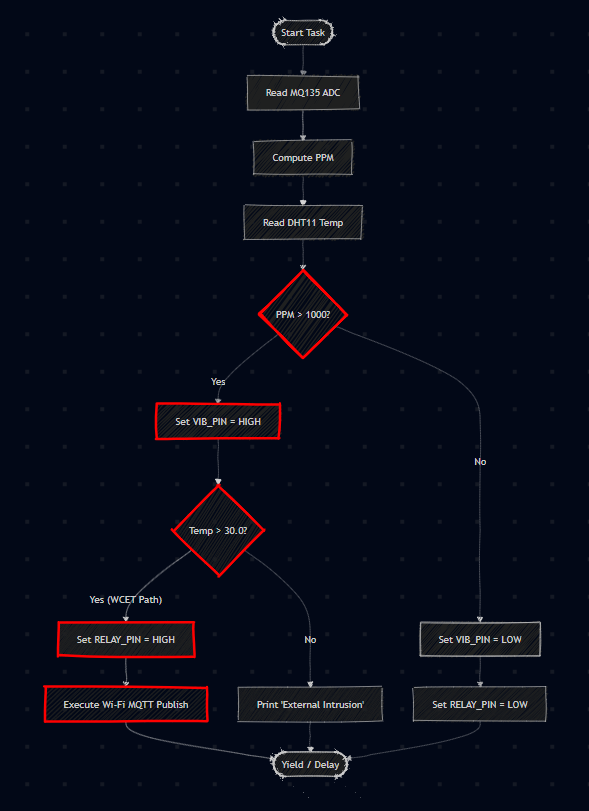

# Neuro-Badge: Wearable AQI Monitor and Cognitive Health Protector

## Project Overview

Neuro-Badge is a low-cost, 4-tier hybrid IoT wearable system designed to monitor indoor air quality (specifically CO2 equivalents and VOCs) to protect students' and professionals' cognitive health.

  
   
  <em>Figure 1: Fully functional Neuro-Badge hardware prototype displaying real-time telemetry.</em>

Instead of passively recording data, the system performs edge-based root-cause analysis by combining MQ135 analog readings with DHT11 temperature context to determine why air quality is degrading. It then triggers proactive countermeasures (such as activating an exhaust relay) and alerts stakeholders via a real-time web dashboard.

---

## 1. System Architecture (Block Diagram)

  

---

## 2. Hardware Components and Total Cost

This prototype was developed with a strict focus on accessibility and cost-efficiency.

| Sr. No. | Component / Item                        | Qty | Rate (INR) | Amount (INR) |
| ------: | --------------------------------------- | --: | ---------: | -----------: |
|       1 | ESP32 WiFi and Bluetooth Board (CP2102) |   1 |        365 |          365 |
|       2 | N2222A NPN Transistor (Pack of 2)       |   1 |          7 |            7 |
|       3 | 4-pin Push Button (5mm, Pack of 3)      |   1 |         10 |           10 |
|       4 | Breadboard (840 Tie Points, GL-12)      |   1 |         65 |           65 |
|       5 | DHT11 Temperature and Humidity Sensor   |   1 |         55 |           55 |
|       6 | 1N4007 Diode                            |   1 |         12 |           12 |
|       7 | Mobile Phone Vibration Motor (3-6V)     |   1 |         35 |           35 |
|       8 | MQ135 Air Quality Sensor Module         |   1 |        140 |          140 |
|       9 | LCD 16x2 (1602) with Pre-Soldered I2C   |   1 |        169 |          169 |
|      10 | Resistors (Assorted)                    |   1 |          5 |            5 |
|      11 | Jumper Wires                            |   6 |         10 |           60 |

**Total Hardware Prototype Cost: INR 923**

---

## 3. System Modeling

### Finite State Machine (FSM)

Neuro-Badge operates as a reactive FSM, transitioning between states based on FreeRTOS timer ticks (polling) and hardware interrupts.

  

### Software Architecture (Object-Oriented Model)

  

---

## 4. Execution Flow Analysis

### Data Flow Graph (DFG): MQ135 PPM Conversion

Demonstrates Single Assignment Form (SAF) optimization for the Xtensa compiler pipeline.

  

### Control Data Flow Graph (CDFG)

Highlights the Worst-Case Execution Time (WCET) path in red (when hazardous conditions trigger an MQTT Wi-Fi payload).

  

---

## 5. Getting Started

### Prerequisites

- Arduino IDE (v2.x recommended)
- ESP32 Board Manager installed in Arduino IDE
- Required libraries:
  - DHT Sensor Library
  - LiquidCrystal I2C
  - Firebase ESP Client

### Installation

1. Clone the repository:
   git clone https://github.com/yourusername/Neuro-Badge.git

2. Open NeuroBadge.ino in Arduino IDE.

3. Update Wi-Fi and Firebase credentials at the top of the sketch:
  - #define WIFI_SSID "YOUR_WIFI"
  - #define WIFI_PASSWORD "YOUR_PASSWORD"
  - #define API_KEY "YOUR_FIREBASE_API_KEY"

4. Compile and upload the code to your ESP32.

5. Open index.html in your browser (preferably using VS Code Live Server) to view the real-time telemetry dashboard.
